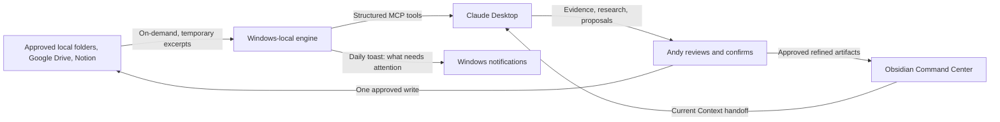
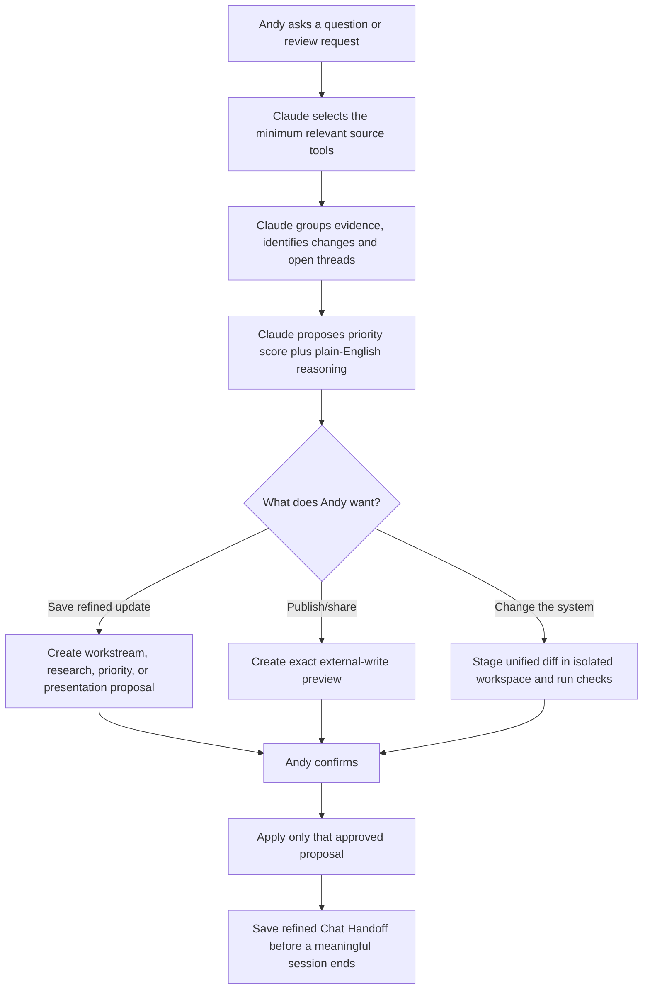

# Andy Brain product specification

Andy Brain is a Windows-local assistant for a JDS operations leader. It answers: **What did Michael ask for? What is still open? What changed? What needs attention? What should I bring to the next meeting?**

## Product contract

| Requirement | Product behavior |
| --- | --- |
| Fragmented working context | Local folders, Google Drive, and Notion are fetched only on demand into Claude’s current tool response. |
| Open threads and Michael follow-ups | Claude proposes workstreams, open threads, due follow-ups, and Michael meeting material; Andy approves the refined result. |
| Holistic, low-friction visual map | Obsidian renders a Command Center, active work, people, decisions, Chat Handoffs, and archive. |
| Research assistance | Claude researches interactively, explains findings/evidence, and proposes a research artifact for the relevant workstream. |
| Priority without brittle rules | Claude proposes a 0–100 score and reasoning. Andy can override either directly in Obsidian or with a confirmed priority-override proposal. |
| Easy Windows setup | A small Tkinter wizard configures the vault, approved folders, output folder, provider credentials, and daily notification. |
| Expandable integrations and workflow | Claude can draft connector/system changes as a unified diff. The engine stages and tests it in an isolated workspace, then installs it only after approval. |
| External collaboration | Drive, Notion, and local generated files are written only by an individually approved external-write proposal. |
| Resilient chat continuity | An approved refined Chat Handoff in the vault lets a new Claude chat continue after Claude or Windows closes. |
| No raw-data mirror | Source content exists only for the active tool call. Engine state retains source metadata/hash; the vault retains refined conclusions, not raw documents. |

## Architecture

## Assistant operating algorithm

## Boundaries and constraints

- Claude Desktop is the primary interaction layer; Andy Brain does not recreate it as a custom dashboard.
- Obsidian is a presentation and durable refined-context layer. It is not a source-document archive.
- Scheduled work can make a local notification and prepare a review prompt; it cannot silently alter source systems or the vault.
- Claude Desktop chat history is not scraped as an unsupported background API. The explicit, approved `Current Context` handoff is the reliable continuation mechanism.
- Google and Notion provider access must be set up on Andy’s Windows account. The engine protects credentials with Windows DPAPI and never exposes them in MCP status output.
